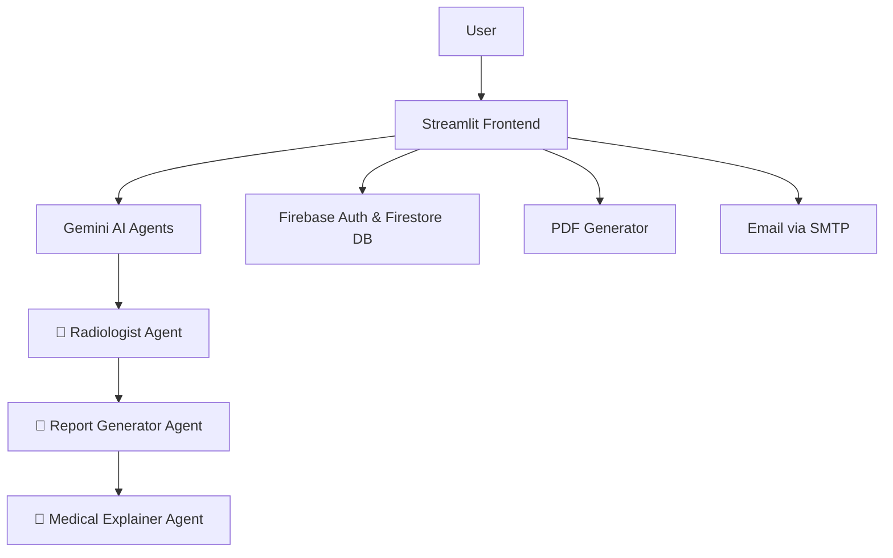

# MedMRI AI - Architecture Documentation

This document provides an overview of the architecture and system components used to build **MedMRI AI**, a Streamlit-based application for analyzing MRI scans using Google's Gemini AI.

---

## 📐 High-Level Architecture



---

## 🧱 Core Components
### AI Agents (Gemini-Powered)
MedMRI AI uses a modular AI-agent pipeline, with each agent built on Google Gemini:
- **Radiologist Agent**: Interprets MRI scans, identifies anatomical regions, and detects abnormalities.
- **Report Generator Agent**: Translates findings into structured medical reports.
- **Medical Explainer Agent**: Converts medical terms into patient-friendly summaries.
  
### 1. **Frontend - Streamlit**
- UI for login, registration, image upload, and report viewing.
- Manages routing between Login/Register, Analysis, Saved Reports, Help, etc.

### 2. **Gemini Vision AI (via google-generativeai)**
- Accepts MRI images and context prompt
- Returns structured medical findings
- Handles:
  - Region Identification
  - Pathology Description
  - Patient-friendly Explanation

### 3. **Firebase**
- **Authentication**: Secure user login and registration
- **Firestore DB**: Stores report data by user ID (image name, analysis, timestamps)

### 4. **Report Generation**
- `ReportLab` + `Pillow`
- Formats findings and images into a downloadable PDF

### 5. **Emailing Reports**
- SMTP utility (Gmail or SendGrid compatible)
- Sends final report with PDF attachment to user’s email

---

## 📂 Modular File Structure

```bash
MedMRI-AI/
├── app.py                    # Router & session manager
├── Main.py                  # (optional legacy)
├── pages/                   # Streamlit views
│   ├── Analyze.py
│   ├── Login.py
│   ├── Register.py
├── agents/                  # AI modules
│   ├── radiologist_agent.py
│   ├── report_agent.py
│   ├── region_identifier_agent.py
├── utils/                   # Support functions
│   ├── pdf_generator.py
│   ├── email_sender.py
│   ├── voice_input.py
├── firebase_config.json     # Firebase credentials
├── requirements.txt         # Python packages
└── README.md
```

---

## 🔁 Data Flow

1. **User logs in** → Session state initialized via Firebase
2. **Uploads image** → Sent to Gemini model with contextual prompt
3. **Region + Findings** → Extracted from model response
4. **PDF + Summary** → Generated and shown to user
5. **Saved** → Report stored in Firestore under user’s UID
6. **Email Option** → Sent via SMTP with PDF attachment

---

## 🛡 Security Notes
- Firebase Authentication manages access control.
- Email credentials are stored in `.streamlit/secrets.toml`
- Report storage is user-scoped using UID filtering in Firestore

---

## 📈 Scalability Notes
- Gemini handles model scaling (external API)
- Firebase scales with user base (auto-managed)
- Can be deployed on Streamlit Cloud
---

---


© 2024 MedMRI AI Project — All rights reserved.
