# 📘 Project Development Documentation

## Project Title: MedMRI AI – A Multimodal Mri Scan Analysis and Reporting System Using Generative AI and AI Agents

### 📌 Overview
MedMRI AI is a multimodal Streamlit application that uses Google’s Gemini AI to analyze MRI images, identify abnormalities, generate medical reports, and assist users through a secure, user-friendly interface.

---

## 🔄 Project Phases

### Phase 1: Requirements & Research (Week 1–2)
- Topic finalization and approval
- Literature review of existing MRI analysis tools
- Defined objectives and success metrics

### Phase 2: System Design (Week 3–4)
- Use case diagrams, architecture planning
- Defined user flow, backend and frontend split
- Created Firebase project

### Phase 3: Implementation (Week 5–8)
- Streamlit UI pages: Login, Register, Analyze, etc.
- Integrated Gemini API for MRI analysis
- Implemented PDF generator and report pipeline

### Phase 4: Testing & Refinement (Week 9–10)
- Image testing with multiple MRI types
- Verified login/session flow and email report
- Fixed error handling, UI polish

### Phase 5: Deployment & Documentation (Week 11–12)
- Finalized code cleanup and folder structure
- Deployed locally / Streamlit Cloud
- Created README, architecture.md, and user manual

---

## 🗓️ Project Timeline

| Month        | Milestone                               |
|--------------|------------------------------------------|
| April        | Project Planning, Requirements Gathering |
| May          | Design Diagrams, UI Design, Setup Firebase |
| June         | Core Implementation (Gemini + Analysis UI) |
| July         | PDF Export, Email Function, Data Saving  |
| August       | Final Testing, Documentation, Deployment  |

---

## AI Agents

MedMRI AI uses specialized AI agents built on Google Gemini to handle various aspects of MRI analysis:

- **Radiologist Agent** – Analyzes the uploaded MRI image to detect anatomical regions and abnormalities.
- **Report Generator Agent** – Structures the findings into a medically coherent report.
- **Medical Explainer Agent** – Converts clinical findings into simplified patient-friendly language.
- **(Optional) Patient Assistant Agent** – Interacts with user questions and helps explain suggested actions.

These agents collaborate in sequence for every MRI image, allowing the application to deliver accurate, explainable, and actionable medical results.

---

## 🧠 AI Agents

```mermaid
flowchart LR
    U[User Uploads MRI Image]
    U --> R[🧠 Radiologist Agent: Identify Region + Abnormalities]
    R --> G[📄 Report Generator Agent: Structured Report]
    G --> E[💬 Medical Explainer Agent: Patient-Friendly Summary]
```

## 🛠 Tools & Technologies

- Google Gemini API (vision + text)
- Streamlit (frontend)
- Firebase (auth + Firestore)
- ReportLab + Pillow (PDF/image)
- SMTP (email sender)
- Python Libraries: `streamlit`, `google-generativeai`, `firebase-admin`, etc.

---

© 2024 MedMRI AI Project — All rights reserved.
